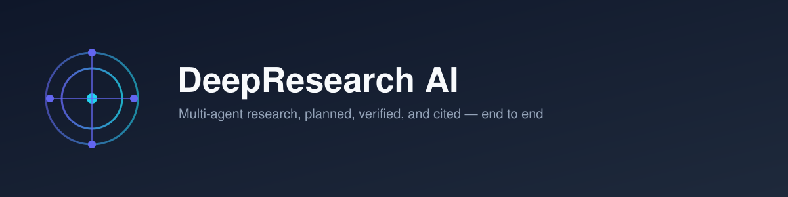
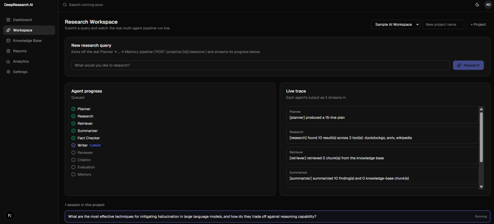
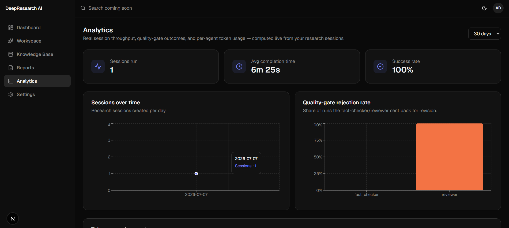
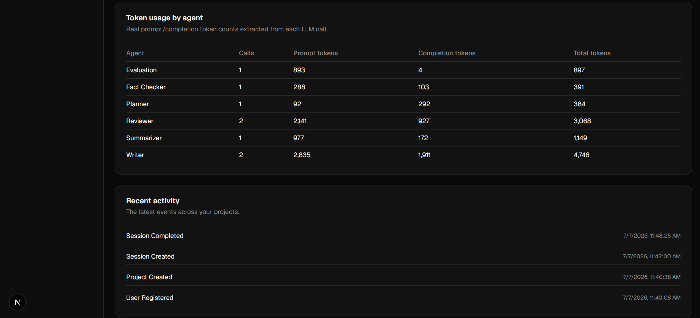
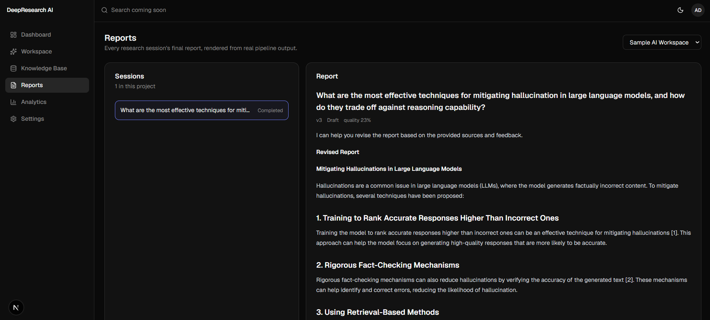
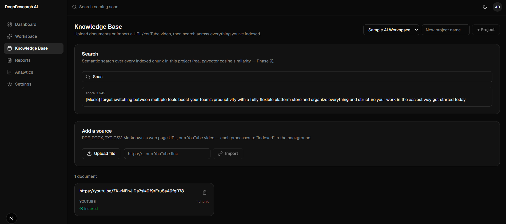

<p align="center">
  
</p>

# DeepResearch AI

> Multi-agent AI research system: ask a question, watch a team of specialized agents plan,
> search, verify, write, and cite a report — backed by a fully local-capable, swappable AI stack.

[](https://github.com/OWNER/deep-research-ai/actions/workflows/ci.yml)
[](LICENSE)
[]()
[](https://github.com/OWNER/deep-research-ai/releases/tag/v1.0.0)

> **Status:** All 15 build phases complete. The full product works end to end: register, create a
> project, submit a research query, watch a real 10-agent LangGraph pipeline run live, and read
> the generated, cited report — deployable via Docker Compose or run natively with a single script.
> See [milestones.md](docs/milestones.md) for the full plan and [CHANGELOG.md](CHANGELOG.md) for
> what shipped in each phase, including every real bug caught along the way.

## Screenshots

| Workspace (live agent progress) | Analytics dashboard |
|---|---|
|  | <br> |

| Finished, cited report | Knowledge Base |
|---|---|
|  |  |

See it end to end: [assets/screenshots/demo.gif](assets/screenshots/demo.gif)

## What this is

DeepResearch AI takes a research question and runs it through a graph of ten cooperating agents —
Planner, Research, Retriever, Summarizer, Fact Checker, Writer, Reviewer, Citation, Evaluation, and
Memory — pulling from the web, Arxiv, Wikipedia, DuckDuckGo, and a user's own uploaded documents,
producing a cited report while showing its work live over a WebSocket.

It runs two ways with no code changes: fully hosted (OpenAI/Anthropic + OpenAI embeddings) or fully
local (Ollama + BGE embeddings) — every LLM, embedding, storage, and search-tool dependency sits
behind a swappable interface. See [tech-stack.md § Replaceability matrix](docs/tech-stack.md#replaceability-matrix).

## Why

Most "AI research assistant" demos are a single prompt to a single model. This project treats
research as what it actually is: a multi-step process with planning, verification, and revision —
modeled explicitly as a stateful, cyclic agent graph (LangGraph) rather than a linear chain, with
every agent's input/output persisted and inspectable, not just the final answer.

## Features

- **Auth** — email/password (JWT access + rotating refresh tokens) and Google/GitHub OAuth.
- **Research Workspace** — submit a query, watch the agent pipeline's real progress stream in live
  over a WebSocket (no polling), then read the finished report.
- **Knowledge Base** — upload PDF/DOCX/TXT/CSV/Markdown, import a URL or YouTube video, and search
  everything with real pgvector cosine-similarity search; the Retriever agent uses the same search
  to ground its own answers.
- **Reports** — every session's generated, cited report, rendered as markdown.
- **Analytics Dashboard** — real session throughput, completion time, quality-gate rejection rate,
  and per-agent token usage — computed from actual pipeline runs, not sample data.
- **Real multi-agent pipeline** — 10 LangGraph nodes with two bounded revision loops
  (fact-checker → research, reviewer → writer), each agent's run persisted for inspection.
- **Observability** — Prometheus + Grafana (HTTP, Celery, and Postgres metrics) alongside the
  in-app Analytics Dashboard, which is product-level data, not infra metrics — see
  [architecture.md § 8](docs/architecture.md#8-deployment-topology-docker-compose-services).
- **Tested, not just built** — 82+ backend/AI tests, frontend component + e2e tests (Playwright,
  including a full live pipeline run through the real browser UI), CI on every push. The 65%
  backend coverage badge is the offline unit-test subset (`pytest --cov`, no live infra); the
  integration/e2e suites that exercise the rest run opt-in against real Postgres/Redis/MinIO/Ollama
  — see [CHANGELOG.md](CHANGELOG.md) for the real bugs each phase's live verification actually
  caught.

## Agent pipeline

```
User Query → Planner → Research → Retriever → Summarizer → Fact Checker ⇄ (loop if unverified, → Research)
           → Writer ⇄ Reviewer (loop if revision needed, → Writer) → Citation → Evaluation → Memory
```

Full diagram and rationale: [architecture.md § 3](docs/architecture.md#3-agent-pipeline).

## Tech stack

**Frontend** — Next.js, React, TypeScript, Tailwind CSS, TanStack Query, recharts, react-markdown
**Backend** — FastAPI, Python, Celery, Redis, SQLAlchemy (async), Alembic
**AI** — LangGraph, OpenAI, Anthropic, Ollama, HuggingFace (BGE embeddings) — hand-rolled
`LLMProvider`/`EmbeddingProvider` interfaces over each vendor's native SDK, not LangChain's model
abstraction (see [tech-stack.md](docs/tech-stack.md) for why)
**Data** — PostgreSQL + pgvector, MinIO (S3-compatible object storage)
**Auth** — JWT + OAuth (Google/GitHub)
**Ops** — Docker Compose, Nginx, Prometheus, Grafana, GitHub Actions

Full justification for each choice: [tech-stack.md](docs/tech-stack.md).

## Getting started

```bash
git clone <this-repo> && cd deep-research-ai
cp .env.example .env   # fill in SECRET_KEY, DB/MinIO passwords, and an LLM provider
```

Two paths, both covered in detail in the docs:

- **Docker Compose** (the whole stack, containers) — [docs/deployment.md](docs/deployment.md).
- **Local dev** (contributing — hot reload, running tests, your own editor/debugger) —
  [docs/installation.md](docs/installation.md).

Either way, once it's up: register an account, create a project, submit a query on the Workspace
page, and watch it run.

## Documentation

| Document | Contents |
|---|---|
| [installation.md](docs/installation.md) | Local development setup — dependencies, running the stack without Docker, tests |
| [deployment.md](docs/deployment.md) | Docker Compose deployment, production overrides, observability, troubleshooting |
| [architecture.md](docs/architecture.md) | Component diagram, agent pipeline graph, clean-architecture layering, DI/replaceability, sequence diagrams — kept current against the real code, not just the original plan |
| [tech-stack.md](docs/tech-stack.md) | Every technology choice with justification, and the replaceability matrix |
| [database-schema.md](docs/database-schema.md) | Full ERD and per-table rationale (Postgres + pgvector) |
| [api-design.md](docs/api-design.md) | REST endpoint catalog (what's actually built vs. still sketched), auth flow, conventions |
| [ui-wireframes.md](docs/ui-wireframes.md) | Original structural wireframes for all 10 screens + navigation map |
| [roadmap.md](docs/roadmap.md) | What's real today vs. genuinely planned next |
| [folder-structure.md](docs/folder-structure.md) | Full repository tree with rationale for the layout |
| [milestones.md](docs/milestones.md) | All 15 build phases with concrete exit criteria |
| [CHANGELOG.md](CHANGELOG.md) | What shipped each phase, and every real bug live verification caught along the way |

## Build plan

This project was built in 15 explicit, sequential phases, each one verified live (against real
infrastructure, not mocks) and approved before the next began — see
[milestones.md](docs/milestones.md) for the full table with exit criteria, and
[CHANGELOG.md](CHANGELOG.md) for the detailed account of each phase, including the real bugs live
verification caught that a code-review-only pass would have missed.

## Contributing

See [CONTRIBUTING.md](CONTRIBUTING.md) — development setup, branching, commit conventions, and PR
expectations.

## License

MIT — see [LICENSE](LICENSE).
