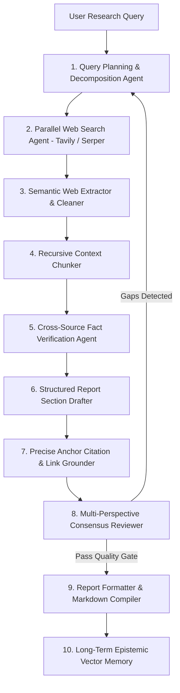

# Deep Research AI — Engineering Guide & Mastery Document

## 1. What Is Deep Research AI?
Deep Research AI is an **autonomous multi-agent research and report generation system**. It executes complex, long-horizon research queries by coordinating a cyclical 10-agent LangGraph workflow that recursively decomposes queries into sub-questions, executes parallel web searches, extracts semantic evidence, validates facts across independent sources, and compiles fully cited, grounded research reports.

## 2. Real-World Problem Solved
1. **Shallow Single-Shot LLM Answers**: Standard LLM prompts summarize queries in one step, missing deep multi-hop evidence and nuance.
2. **Unverified Web Claims**: Web search results contain factual inaccuracies, sponsored content, and hallucinations.
3. **Missing Citation Grounding**: Generic research tools cite dead links or synthesize false claims attributed to real URLs.
4. **Context Window Exhaustion**: Raw search pages easily overflow LLM context limits without recursive summarization and hierarchical chunking.

## 3. High-Level Multi-Agent Architecture

## 4. Algorithmic Complexity & LangGraph State Machine
- **Cyclical Graph Execution**: State dictionary passed immutably across agent nodes containing `query`, `sub_questions`, `evidence_pool`, `draft_sections`, `citation_map`, and `iteration_count`.
- **Fact-Checking Consensus**: Computes source agreement metric:
  $$\text{ConsensusScore}(claim) = \frac{\sum_{s \in \text{Sources}} \text{Support}(s, claim)}{|\text{Sources}|}$$
  Claims with consensus $< 0.70$ are flagged for secondary search verification.

## 5. Security & Rate-Limit Safeguards
- Tavily/Serper search rate limiters with exponential backoff.
- Strict token budgeting per agent node to prevent unbounded API spend.

## 6. Testing Strategy
- Automated pytest evaluation benchmarks verifying grounding accuracy, fact extraction fidelity, and cycle termination invariants.
