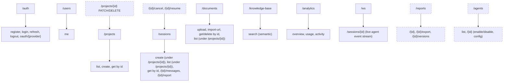
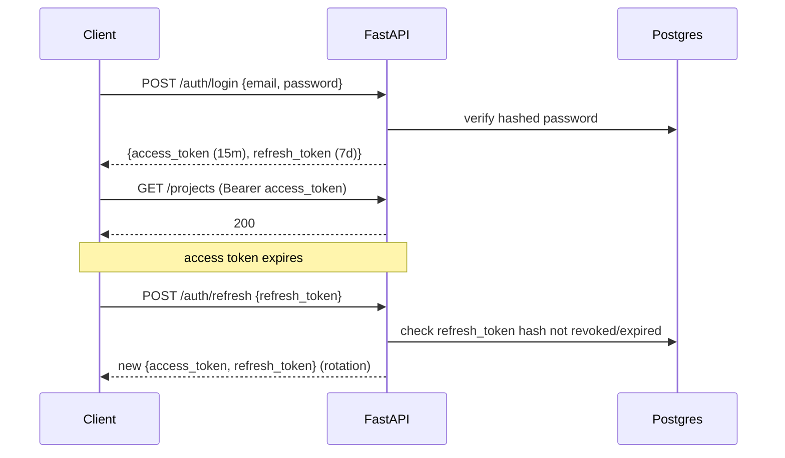

# API Design

Base path: `/api/v1` — versioned from day one so a breaking `v2` can ship later without disrupting
existing clients. OpenAPI schema auto-generated by FastAPI at `/api/v1/openapi.json`, interactive
docs at `/api/docs` (Swagger) and `/api/redoc`.

## 1. Conventions

- **Auth**: `Authorization: Bearer <access_token>` on every endpoint except `/auth/*` and `/health`.
- **Pagination**: not yet implemented — every list endpoint (`GET /projects`,
  `GET /projects/{id}/sessions`, `GET /projects/{id}/documents`) currently returns the full,
  unpaginated array. Fine at this project's real scale (a handful of projects/sessions per user in
  every live verification so far); cursor-based pagination (`?cursor=<opaque>&limit=20`, chosen over
  offset because these lists are append-only and grow continuously — offset pagination drifts under
  concurrent inserts) is the intended design once it's actually needed, not something to build
  ahead of a real requirement.
- **Filtering**: query params scoped per resource, e.g. `GET /projects/{id}/sessions?status=completed`
  — not yet built on any endpoint (every list is currently unfiltered too); same "build when needed"
  reasoning as pagination above.
- **Rate limiting** (built — Phase 3, `app/core/rate_limit.py`): token-bucket via `slowapi`, default
  100 req/min per client, in-memory storage (single-process — fine for local dev and the
  single-`backend`-replica topology `docker-compose.yml` actually runs; noted in that module's
  docstring as a one-line `storage_uri` swap to Redis if a multi-replica deployment ever needs
  shared limit state, not yet done since nothing in this project has needed it). `POST /auth/register`
  and `POST /auth/login` both override the default at `10/minute` per IP (`@limiter.limit("10/minute")`
  in `app/api/v1/auth.py`) — no other route currently overrides the default, including session
  creation (an earlier version of this document described a session-creation-specific limit that
  was never actually implemented).
- **Errors**: RFC 7807 problem+json shape — `{type, title, status, detail, instance}` — consistent
  across every endpoint via a global FastAPI exception handler.
- **Idempotency**: not implemented. An earlier version of this document described an
  `Idempotency-Key` header for `POST /sessions`; a client retry after a dropped connection today
  really can enqueue a duplicate research run. Worth building before this is used somewhere a
  flaky connection is likely (mobile clients, unreliable networks) — not yet a problem in any
  environment this has actually run in.

## 2. Resource map

Solid boxes are built; dashed ones are sketched in the endpoint catalog (§ 3) below but not
implemented yet — kept in the map so the intended full shape stays visible, not because they exist.

## 3. Endpoint catalog

### Infra (built — Phase 3)
| Method | Path | Notes |
|---|---|---|
| GET | `/health` | Liveness check, unversioned (outside `/api/v1` — infra checks aren't part of the business API's version contract). No auth, no dependencies; returns `{status, version}`. |
| GET | `/api/docs` / `/api/redoc` | Interactive OpenAPI UI (Swagger / ReDoc). |
| GET | `/api/v1/openapi.json` | OpenAPI schema. |
| GET | `/api/v1/metrics` | Prometheus scrape target (`prometheus-fastapi-instrumentator`), excluded from the OpenAPI schema. |

### Auth (built — Phase 5)
| Method | Path | Notes |
|---|---|---|
| POST | `/auth/register` | email + password, or triggers OAuth flow client-side |
| POST | `/auth/login` | returns access + refresh token pair |
| POST | `/auth/refresh` | rotates refresh token |
| POST | `/auth/logout` | revokes refresh token |
| GET | `/auth/oauth/{provider}` | redirect to Google/GitHub OAuth consent |
| GET | `/auth/oauth/{provider}/callback` | exchanges code, issues JWT pair |

### Projects (built — Phase 8)
| Method | Path | Notes |
|---|---|---|
| GET | `/projects` | owned by current user (pagination still TODO — small N for now) |
| POST | `/projects` | create, `201` |
| GET | `/projects/{id}` | detail; `404` (not `403`) if it exists but isn't the caller's, so ownership can't be probed by status code |
| PATCH | `/projects/{id}` | rename/archive — not yet built |
| DELETE | `/projects/{id}` | soft delete — not yet built |

### Research Sessions (built — Phase 8)
| Method | Path | Notes |
|---|---|---|
| POST | `/projects/{id}/sessions` | creates the session row (`status="queued"`) and enqueues `research.run_pipeline` via Celery, `201` with the created session |
| GET | `/sessions/{id}` | current `status`/`revision_count` (no `graph_state` in the response body yet — that's on the ORM row, not the schema) |
| GET | `/sessions/{id}/messages` | full per-node trace, oldest first (pagination still TODO) |
| GET | `/sessions/{id}/report` | latest `Report` for the session, `404` until the pipeline reaches the Citation/Evaluation/Memory nodes |
| GET | `/projects/{id}/sessions` | list a project's sessions, newest first (**built — Phase 12**; the service/repository method existed since Phase 8, just never had a route) — powers the Workspace/Reports pages |
| POST | `/sessions/{id}/cancel` | cooperative cancellation — not yet built |
| POST | `/sessions/{id}/resume` | resume from last checkpoint — not yet built (the `graph_state` JSONB checkpoint exists on the row; nothing reads it back into a resumed run yet) |

### Documents (built — Phase 10)
| Method | Path | Notes |
|---|---|---|
| POST | `/documents/upload` | multipart upload (PDF/DOCX/TXT/CSV/Markdown) → MinIO (`app/core/object_storage.py`) + `Document` row (`status="pending"`) + enqueues `knowledge_base.process_document`, `201` |
| POST | `/documents/import-url` | body `{project_id, url}` — source_type auto-detected (`youtube.com`/`youtu.be` host → `youtube`, else `url`); no bytes stored, `storage_path` holds the source URL itself, fetched fresh when the task runs |
| GET | `/documents/{id}` | metadata + processing status (`pending\|processing\|indexed\|failed`) |
| DELETE | `/documents/{id}` | soft-deletes the document (embeddings cascade at the DB level via `ON DELETE CASCADE`) |
| GET | `/projects/{id}/documents` | list a project's documents with each one's chunk count — not in the original Phase 1 sketch, added since the KB browser UI needs it |

### Knowledge Base (built — Phase 9 search, Phase 10 ingestion + UI)
| Method | Path | Notes |
|---|---|---|
| GET | `/knowledge-base/search?project_id=&q=&top_k=` | real pgvector cosine-similarity search (`app/repositories/embedding.py`), scoped to the given project (`404`, not `403`, if it isn't the caller's — same non-disclosure posture as `/projects/{id}`). Used by the Retriever Agent (via `app/services/pg_vector_store.py`, not this HTTP endpoint directly) and the real KB browser page (`frontend/app/(dashboard)/knowledge-base/page.tsx`). |
| — | *(no direct ingest-raw-text endpoint)* | `KnowledgeBaseService.ingest_text(project_id, uploader_id, filename, source_type, text)` (Phase 9) is still service-layer-only, for callers that already have plain text in hand (tests). The real upload/import path (above) goes through `ai/loaders/` first, then the same underlying chunk/embed/index logic. |

### Reports (partially built — Phase 8's `/sessions/{id}/report` only)
| Method | Path | Notes |
|---|---|---|
| GET | `/sessions/{id}/report` | **built, Phase 8** — the only report access point so far (see Research Sessions above); the frontend's Reports page (Phase 12) is built entirely on this one endpoint plus `GET /projects/{id}/sessions` |
| GET | `/reports/{id}` | latest version content by the report's own id, independent of its session — not yet built |
| GET | `/reports/{id}/versions` | revision history — not yet built (`reports.version` is tracked on the model; nothing exposes the history yet) |
| POST | `/reports/{id}/export` | body: `{format: markdown\|pdf\|docx\|html}` → `202`, returns export job id — not yet built (`report_exports` table exists in the schema, unused) |
| GET | `/reports/{id}/export/{export_id}` | download link once ready — not yet built |

### Agents (not yet built)
| Method | Path | Notes |
|---|---|---|
| GET | `/agents` | list agent types + enabled/config state — not yet built. The `agents` table (seeded, Phase 7) exists and is read by the pipeline/analytics internally; nothing exposes it over HTTP yet |
| PATCH | `/agents/{id}` | enable/disable, adjust config (e.g. max revision loops) — admin only — not yet built; `Settings.max_revision_loops` is the only knob today, and it's a deployment-time env var, not a runtime-editable one |

### Analytics (built — Phase 11)
| Method | Path | Notes |
|---|---|---|
| GET | `/analytics/overview?days=` | real (non-mock) aggregates over the caller's own `research_sessions`/`agent_runs`, scoped to the last N days (default 30): `sessions_run`, `avg_completion_seconds`, `success_rate`, `sessions_over_time` (per-day counts), `agent_rejection_rates` (fact_checker/reviewer quality-gate rejection rate — see `app/services/analytics_service.py`'s docstring for why this, not a per-node crash rate, is what's actually derivable from persisted data) |
| GET | `/analytics/usage?days=` | real per-agent LLM token usage (`prompt_tokens`/`completion_tokens`/`call_count`), extracted from each vendor's own response (`ai/llm/*_provider.py`'s `LLMResponse`) and persisted on `AgentRun.output_state` — no new migration needed |
| GET | `/analytics/activity?limit=` | recent `analytics_events` rows for the caller (registration, project/session/document lifecycle events), newest first |

### WebSocket (built — Phase 8)
| Path | Notes |
|---|---|
| `/ws/sessions/{id}?token=<access_token>` | Mounted at the app root, not under `/api/v1` (see `app/api/ws.py`). JWT passed as a query param — browsers can't set custom headers during the WS handshake. Relays `app/core/pubsub.py` events verbatim: `{"type": "status", "status": "running"\|"completed"\|"failed"}` and `{"type": "node_update", "node": <AgentName>, "messages": [...]}` per graph step (published by `app/workers/tasks.py` as it streams `graph.astream(..., stream_mode="updates")`). Closes the socket after a terminal `status` event. |

## 4. Auth flow

## 5. Validation & schemas

Every request/response body is a Pydantic v2 model in `backend/app/schemas/`, separate from
SQLAlchemy models in `backend/app/models/` — a schema is a wire contract, a model is a storage
contract, and they are allowed to diverge (e.g. a session response never serializes the full
`graph_state` blob, only a derived `current_node` + `progress_percent`).
