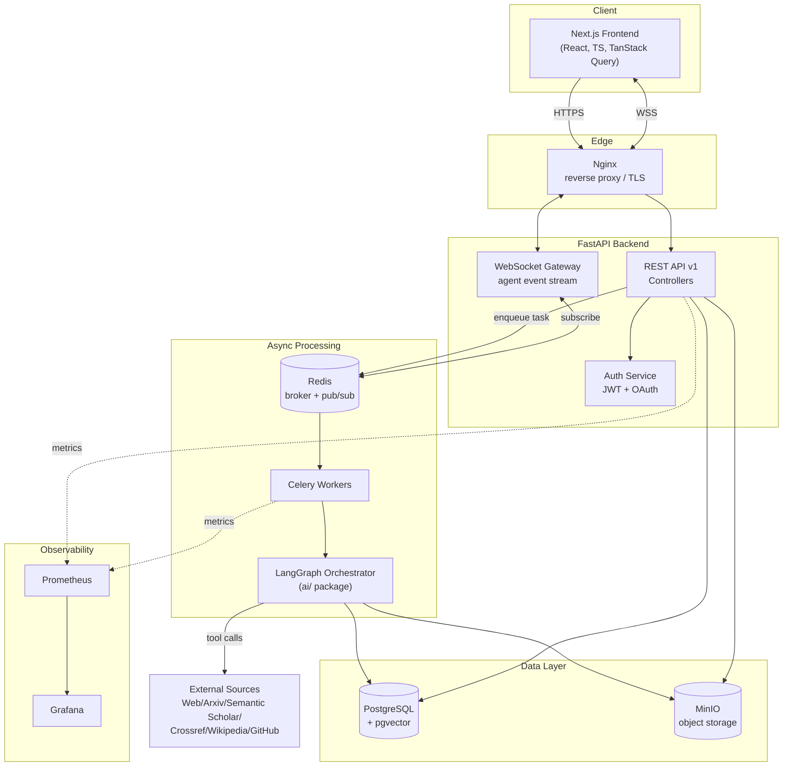
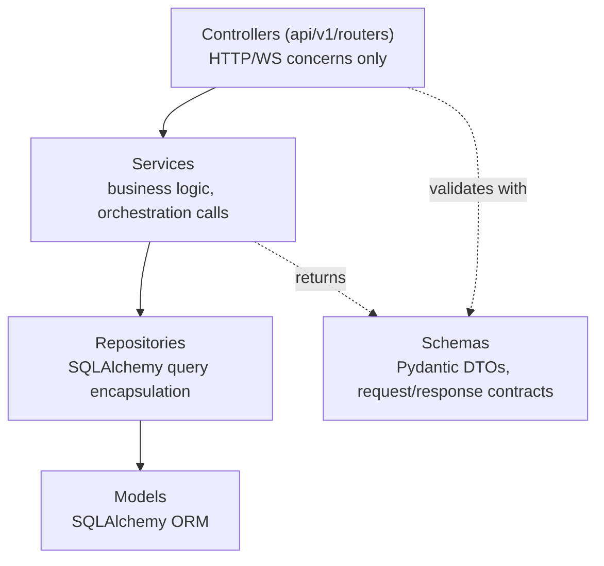
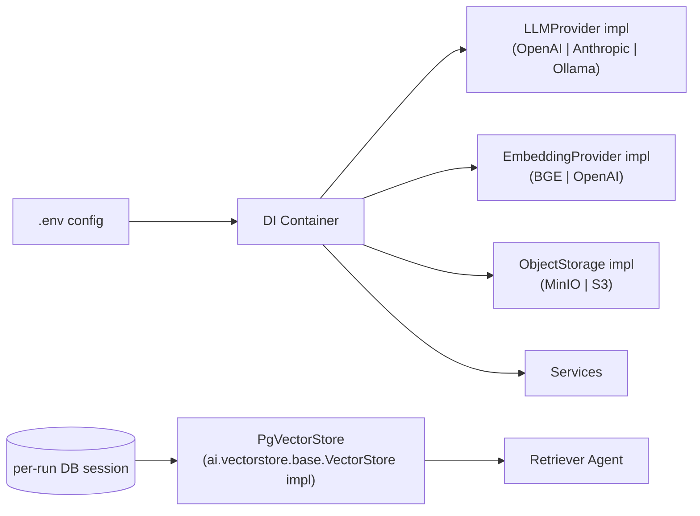
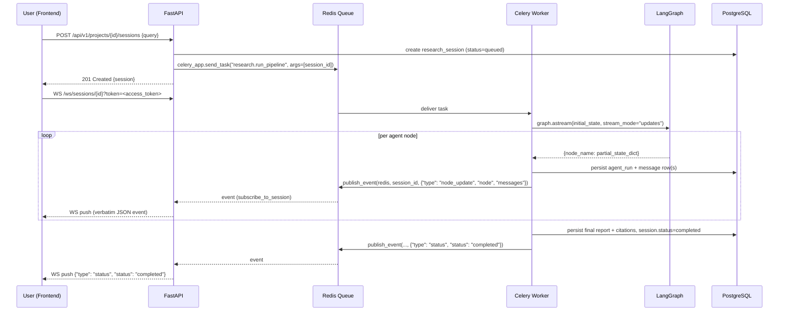
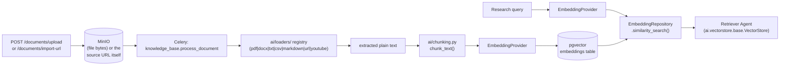

# System Architecture

## 1. High-level component diagram

## 2. Why LangGraph, not a linear chain

The pipeline is a **directed graph with cycles**, not a pipeline of one-shot steps:

- The **Fact Checker** can send the state back to the **Research Agent** if a claim can't be verified from retrieved sources.
- The **Reviewer** can send the state back to the **Writer** if quality scoring falls below threshold.
- The **Evaluation Agent** runs after Citation and can trigger a bounded number of revision loops before forcing completion.

LangGraph models this as a `StateGraph` with conditional edges and a shared, typed `ResearchState` object, with checkpointing so a long-running research session can be paused/resumed and inspected mid-flight (this is also what powers the "Agent Workflow Visualization" screen — the frontend renders the graph's current node as it executes).

## 3. Agent pipeline

```mermaid
flowchart LR
    Q["User Query"] --> P["Planner Agent"]
    P --> R["Research Agent"]
    R --> RT["Retriever Agent<br/>(pgvector)"]
    RT --> S["Summarizer Agent"]
    S --> FC["Fact Checker"]
    FC -->|claim unverified| R
    FC -->|verified| W["Writer Agent"]
    W --> RV["Reviewer Agent"]
    RV -->|needs revision| W
    RV -->|approved| C["Citation Agent"]
    C --> EV["Evaluation Agent"]
    EV --> M["Memory Agent<br/>(persist to KB)"]
    M --> EX["Report Export"]
```

(Phase 7 note: this diagram was corrected here — the original Phase 1 version omitted the
Summarizer agent from the graph entirely. It sits between Retriever and Fact Checker: it
compresses raw research_findings + retrieved_context into what Fact Checker/Writer actually
consume, which is also why fact-checking needs to happen after it, not before.)

Each agent is a node function `(state: ResearchState) -> ResearchState` registered on the graph.
Every agent implements the same `BaseAgent` protocol so new agents can be added without changing
the graph wiring code, only the edges.

## 4. Backend clean architecture (layering)

Rules enforced by this layering:

- Controllers never touch SQLAlchemy directly — only call a Service.
- Services never construct HTTP responses — they return domain objects/Pydantic schemas.
- Repositories are the only layer that knows SQL/ORM query shape; swapping the ORM only touches this layer.
- The `ai/` package (agents/graph/tools) is invoked *by* a Service (`ResearchService`), never by a Controller directly, and never imports from `api/` — keeping the AI package usable as a standalone library.

## 5. Dependency injection & replaceability

A small DI container (constructed at app startup in `backend/app/core/container.py`) wires concrete
implementations to interfaces based on environment configuration:

This is what makes "each component independently replaceable" true in practice rather than
aspirational: no agent or service imports `openai` or `anthropic` directly — they depend on the
`LLMProvider` protocol defined in `ai/llm/base.py`. `VectorStore` (Phase 9) is deliberately *not* a
`Container` `cached_property` like `llm`/`embeddings`: pgvector search needs a live `AsyncSession`
scoped to one request/pipeline run, not a process-lifetime singleton, so `PgVectorStore` is
constructed fresh per use (`app/workers/tasks.py` for the graph, `app/api/deps.py`'s
`get_knowledge_base_service` for the search endpoint) — same reasoning as `AuthService` not living
on the container either (see that class's docstring).

## 6. Request flow: starting a research session

Implemented in Phase 8 (`backend/app/workers/tasks.py`, `backend/app/core/pubsub.py`,
`backend/app/api/ws.py`) — see `docs/api-design.md`'s Research Sessions / WebSocket sections for the
exact endpoint and event shapes. Two things this diagram doesn't show, worth calling out:

- **Revision loops**: `fact_checker` can route back to `research`, and `reviewer` back to `writer`
  (see § 3's graph diagram), each bounded by `Settings.max_revision_loops` (shared cap across both
  loops via `research_sessions.revision_count`). `astream(..., stream_mode="updates")` yields each
  node's own *partial* return value, not the graph's internally-reduced state — the worker replicates
  the `operator.add` reducer for the `messages`/`errors`/`research_findings` fields itself
  (`app/workers/tasks.py::_merge_state`) so the `graph_state` JSONB checkpoint it persists matches
  what `graph.ainvoke()` would have returned.
- **Agent identity**: `agent_runs.agent_id` is `NOT NULL` / `ON DELETE RESTRICT` against a seeded
  `agents` reference table (`backend/app/scripts/seed.py`, one row per `ai.graph.state.AgentName`) —
  a database that hasn't been seeded will fail a session with a clear error rather than a raw FK
  violation.
- **Worker connection-pool lifetime** (Phase 10 finding, applies to both this task and
  `knowledge_base.process_document_task` below): each task entrypoint wraps its async body in its
  own `asyncio.run(...)`, which tears down that call's event loop on return — but `_container`
  (`app/workers/tasks.py`) is a module global reused across every task the worker process ever runs.
  A pooled asyncpg connection is bound to the loop that created it; without disposing the engine at
  the end of each task, the *next* task's new event loop can be handed a connection from a prior,
  now-closed loop and crash (`AttributeError: 'NoneType' object has no attribute 'send'` deep in
  asyncpg). Caught live running a real Celery worker through two documents back to back — a single
  isolated task (which is all any test harness had exercised until then) never hits it. Fixed by
  disposing `container.db_engine` in a `finally` block at the end of every task
  (`app/workers/tasks.py::_release_event_loop_bound_connections`).
  `container.redis` has the exact same defect and is fixed the same way (`aclose()`, not a
  replacement object — see that function's docstring): it went uncaught until Phase 11, since
  `publish_event` (the only thing in either task that touches `container.redis`) only runs inside
  *this* task, and every prior real-Redis worker test (Phase 10) exercised
  `process_document_task` instead, which never calls it. Caught live running two real (not
  fakeredis) research pipeline sessions back to back against one worker process — the second
  crashed with `RuntimeError: Event loop is closed` deep in redis-py's connection tail.
  `container.llm` — every vendor `LLMProvider` wraps its SDK's own async httpx-based client,
  equally cached for the worker's lifetime — turned out to have the same defect a third time,
  caught the same way (the second of two real pipeline runs crashed mid-`planner`-node in
  httpcore instead of redis-py). An SDK client has no cross-loop-safe reconnect, so it's handled
  differently from the other two: the `llm` `cached_property` is dropped entirely rather than
  closed, so the next task's first access rebuilds a fresh provider on its own loop at no real
  cost (the actual connection opens lazily on first request either way).
  `container.embeddings` is deliberately *not* reset the same way — the default local BGE
  provider runs `sentence-transformers` inference via `asyncio.to_thread`, with no persistent
  async client to go stale in the first place, and forcing a model reload every task (multi-second,
  and on the hot path of every `knowledge_base.process_document_task` call too) would be a pure
  regression for the common case.

## 7. Data flow: retrieval-augmented context

Implemented in Phase 9: `ai/chunking.py` (paragraph-aware, overlapping — not LangChain's
splitters; docs/tech-stack.md scopes those to Phase 10's format-aware loaders), `ai/vectorstore/base.py`
(the `VectorStore` ABC the Retriever agent depends on — mirrors `ai/tools/base.py`'s pattern: ai/
defines the interface and a `NullVectorStore` default, the backend constructs the real
implementation and injects it), `app/services/pg_vector_store.py` (the pgvector-backed adapter,
constructed per pipeline run in `app/workers/tasks.py` from that run's own DB session),
`app/repositories/embedding.py` (the actual `<=>` cosine-distance query, `ORDER BY` ascending
distance, scoped to the requesting project via a join on `documents`), and
`app/services/knowledge_base_service.py` (`ingest_text`/`search`).

Implemented in Phase 10: `ai/loaders/` (`BaseLoader` ABC + one implementation per source type —
`pypdf`, `python-docx`, `markdown-it-py` rendered to HTML then stripped via BeautifulSoup,
`youtube-transcript-api`, and BeautifulSoup again for arbitrary web pages — plus a registry keyed by
`source_type`, mirroring `ai/tools/`'s pattern), `app/core/object_storage.py` (a boto3 S3 client
against MinIO, wrapped in `asyncio.to_thread` since boto3 itself is synchronous; a `Container`
`cached_property` like `redis`, not per-request like `VectorStore` — an S3 client has no
request-scoped state to isolate), and `KnowledgeBaseService.upload_document`/`import_url` +
`process_document` (the router persists bytes/URL and a `pending` `Document` row synchronously;
`process_document_task` — a Celery task — does the actual fetch-back/extract/chunk/embed/index,
mirroring the research pipeline's queued-then-processed-async shape). The real KB browser UI
(`frontend/app/(dashboard)/knowledge-base/page.tsx`) drives all of this, polling
`GET /projects/{id}/documents` while anything is `pending`/`processing`.

One constraint worth knowing before configuring `EMBEDDING_PROVIDER` for a non-default model:
`embeddings.embedding` is a **fixed** `vector(1024)` column (`app/models/embedding.py`'s
`EMBEDDING_DIMENSION`), sized for BGE-large's native dimension — set at migration time, not derived
from `Settings.embedding_dimension` at runtime. Configuring a provider that produces a different
dimension (e.g. OpenAI's `text-embedding-3-small`, 1536-dim) without a matching migration fails at
the SQL level (pgvector rejects the mismatched vector) the moment anything actually queries or
inserts — not at startup. Caught living: an earlier version of this phase's own integration test
used a smaller/faster BGE variant for the *worker's* embedding provider (384-dim) while the schema
stayed at its real 1024-dim default, and the Retriever agent's first live query failed with exactly
this error.

## 8. Deployment topology (Docker Compose services)

`frontend`, `backend`, `worker` (Celery — runs the LangGraph pipeline and document processing),
`beat` (Celery's periodic-task scheduler — present in the topology and wired into
`docker-compose.yml` since Phase 2, but `app/workers/celery_app.py` defines no `beat_schedule`, so
it currently has nothing to schedule; every aggregate the Analytics Dashboard shows — Phase 11 —
is computed live, per request, not via a periodic rollup job. Reserved for real recurring
maintenance work, e.g. expiring old refresh tokens, once there's an actual candidate for it),
`postgres`, `redis`, `minio`, `nginx`, `prometheus`, `grafana`, plus two Phase 13 metrics sidecars
(`celery-exporter`, `postgres-exporter`) — one service per container, wired by
`docker-compose.yml`, with a production override (`docker-compose.prod.yml`) that drops dev
bind-mounts and adds resource limits. Full detail in `docs/deployment.md`.
