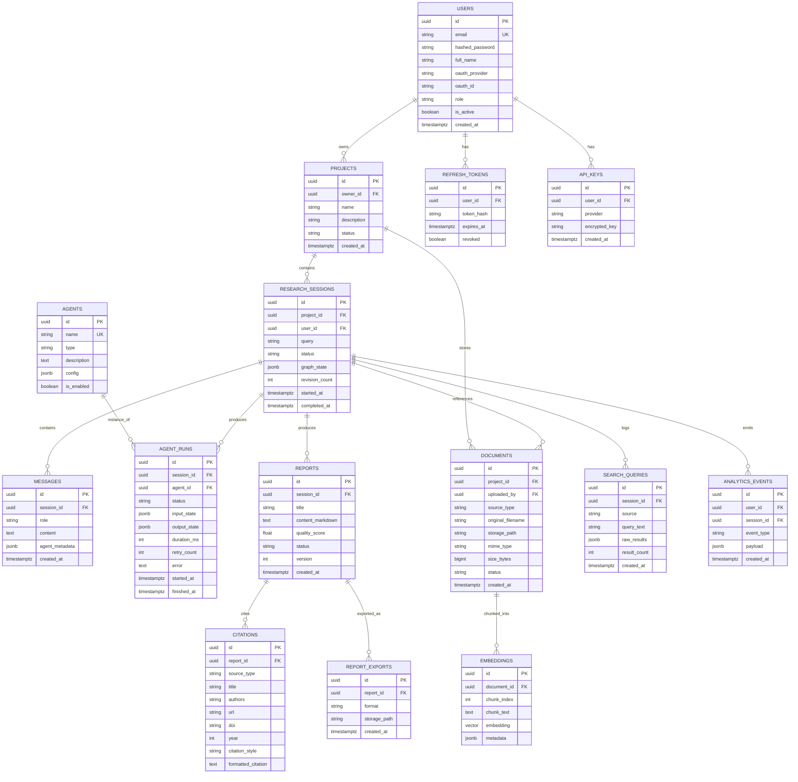

# Database Schema

PostgreSQL 16+ with the `pgvector` extension. All primary keys are client-generated UUIDv4
(Python-side `default=uuid.uuid4`, not a DB extension like `uuid-ossp`/`pgcrypto` — one fewer
extension to install, and the app knows a new row's id before INSERT). All tables have
`created_at` / `updated_at` (ORM-managed: `server_default=func.now()` / `onupdate=func.now()`).
Soft-delete via `deleted_at` on user-facing entities (users, projects, sessions, documents,
reports) so nothing is hard-deleted from under an active foreign key without an explicit admin
operation. Implemented in Phase 4 as SQLAlchemy models in `backend/app/models/` — see
[`database/README.md`](../database/README.md) for how migrations, `schema.sql`, and the models
relate.

## 1. Entity-relationship diagram

## 2. Table notes

### `users`
Standard auth entity. `oauth_provider`/`oauth_id` nullable — populated only for OAuth signups;
`hashed_password` nullable for OAuth-only accounts. `role` is an enum (`admin`, `member`) enforced
at the application layer via a Postgres `CHECK` constraint.

### `projects`
A project is the top-level container a user organizes research under (mirrors "Project Dashboard"
in the UI). `status`: `active | archived`.

### `research_sessions`
One row per research run. `graph_state` stores the *last checkpointed* LangGraph state as JSONB —
this is what allows resuming a session and what the Agent Workflow Visualization reads to render
current progress on reload. `status`: `queued | running | awaiting_revision | completed | failed`.

### `documents`
Covers both user-uploaded files and imported websites/YouTube transcripts. `source_type`:
`pdf | docx | txt | csv | markdown | url | youtube`. `storage_path` is a MinIO object key, not a
local filesystem path — this is what keeps storage swappable to S3.

### `embeddings`
`embedding` is a `vector(N)` column (dimension fixed per embedding provider, e.g. 1024 for BGE-large,
1536 for OpenAI `text-embedding-3-small`) with an IVFFlat or HNSW index for cosine similarity search.
`metadata` carries page number / section heading for citation traceability back to source location.

### `agents` / `agent_runs`
`agents` is a small, mostly-static reference table (one row per agent type: planner, research,
retriever, summarizer, writer, reviewer, fact_checker, citation, memory, evaluation) — this is what
the Agent Monitor screen lists and what lets an agent be disabled/reconfigured (`config` jsonb)
without a schema change. `agent_runs` is the append-only execution log per session per agent,
the source of truth for both the workflow visualization (live) and analytics (historical).

### `reports`
`version` increments on every Reviewer-triggered revision, so report history is retained rather
than overwritten — supports an eventual "diff between report versions" feature without a schema
change now.

### `citations`
One row per source citation, generated by the Citation Agent, `citation_style`: `apa | mla | ieee`.
Formatted lazily via `formatted_citation` cache column, source fields (`doi`, `authors`, `year`)
kept structured so re-formatting to a different style doesn't require re-fetching the source.

### `search_queries`
Full audit trail of every external search call (which source, what query, how many results) —
both for debugging agent behavior and for the "Search History" UI feature.

### `analytics_events`
Generic event log (`event_type`: `session_started`, `session_completed`, `report_exported`,
`agent_failed`, ...) that the Analytics Dashboard aggregates over — kept generic rather than one
table per metric so new metrics don't require migrations.

## 3. Indexing strategy

- `embeddings.embedding`: HNSW index (`vector_cosine_ops`) — primary retrieval path.
- `research_sessions(project_id, status)`, `documents(project_id)`, `agent_runs(session_id)`,
  `analytics_events(user_id, created_at)`: composite B-tree indexes for the dashboard/list queries
  that filter and sort by these.
- All FK columns indexed by default via Alembic migration convention.

## 4. Migrations

Alembic, one migration per schema change, autogenerated from SQLAlchemy models and hand-reviewed —
never hand-written raw SQL migrations unless it's a data migration (backfill) that autogenerate
can't express.
