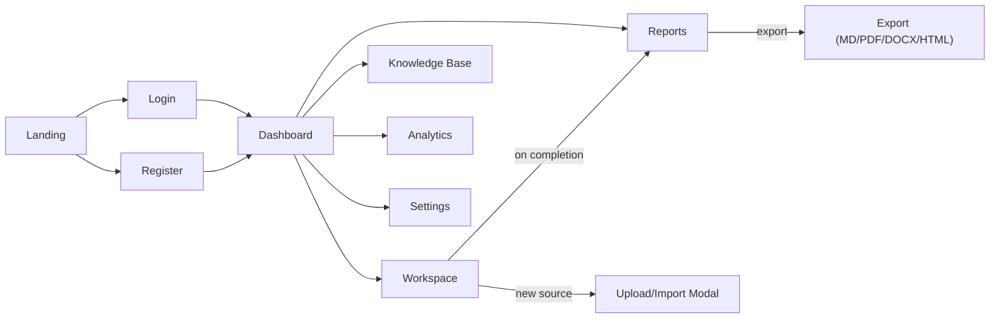

# UI Wireframes

Design language: dark-mode-first, high information density without clutter — reference points are
Linear (sidebar + command-driven navigation), Notion (workspace canvas), Vercel (dashboard chrome),
Perplexity (query → streaming answer with sources), Anthropic Console (clean agent/tool call trace).

These are structural wireframes (layout + hierarchy), not visual design — spacing, type scale, and
color tokens are defined later in the frontend design-system phase.

## 1. Landing page

```
┌─────────────────────────────────────────────────────────────┐
│  [Logo] DeepResearch AI          Features  Docs  [Sign in] [Get started] │
├─────────────────────────────────────────────────────────────┤
│                                                               │
│        Multi-agent research, from question to cited report   │
│        [ query input box, big, centered ]  [Start researching →] │
│                                                               │
│        ▸ Planner → Research → Fact-check → Write → Cite       │
│          (animated pipeline preview)                          │
│                                                               │
│   ── Feature grid: Web+Arxiv+Scholar search / Knowledge base / │
│      Multi-format export / Local-first (Ollama) ──            │
│                                                               │
│   ── Footer: GitHub, License, Docs ──                         │
└─────────────────────────────────────────────────────────────┘
```

## 2. Auth pages (Login / Register)

```
┌───────────────────────────────┐
│        [Logo]                 │
│   Sign in to DeepResearch AI   │
│                                │
│   [ email             ]       │
│   [ password          ]       │
│   [        Sign in        ]   │
│   ──────────  or  ──────────  │
│   [ Continue with Google ]    │
│   [ Continue with GitHub ]    │
│                                │
│   No account? Register →      │
└───────────────────────────────┘
```

## 3. Dashboard shell (applies to every authenticated screen)

```
┌──────────┬────────────────────────────────────────────────────┐
│ Sidebar  │  Top bar: [Project: Acme ▾]      [🔍 search]  [🌙][👤]│
│          ├────────────────────────────────────────────────────┤
│ Workspace│                                                    │
│ KB       │                                                    │
│ Reports  │              < page content >                      │
│ Analytics│                                                    │
│ Settings │                                                    │
│          │                                                    │
│ ──────── │                                                    │
│ + New    │                                                    │
│ Project  │                                                    │
└──────────┴────────────────────────────────────────────────────┘
```

Sidebar is icon+label, collapsible to icon-only (Linear-style). Project switcher lives in the top
bar because a user's sidebar sections (Workspace/KB/Reports/Analytics) are scoped to the active
project.

## 4. Project dashboard (list of research sessions)

```
┌──────────┬────────────────────────────────────────────────────┐
│ Sidebar  │  Acme Project                      [+ New Research] │
│          ├────────────────────────────────────────────────────┤
│          │  Filter: [All ▾] [Status ▾]         Search: [____]  │
│          │  ┌──────────────────────────────────────────────┐  │
│          │  │ ● Completed  "Impact of RAG on..."   2h ago   │  │
│          │  │ ● Running    "Comparative study of..." 3m ago │  │
│          │  │ ● Failed     "Survey of vector DBs"   1d ago  │  │
│          │  └──────────────────────────────────────────────┘  │
└──────────┴────────────────────────────────────────────────────┘
```

## 5. Research Workspace (core screen — 3-pane)

```
┌──────────┬───────────────────────────┬─────────────────────────┐
│ Sidebar  │  Agent Workflow Monitor   │  Source / Citation Panel │
│          │  ┌─────────────────────┐  │  ┌───────────────────┐  │
│          │  │ ● Planner    done   │  │  │ [1] Smith et al.  │  │
│          │  │ ● Research   done   │  │  │ [2] arxiv:2401.xx │  │
│          │  │ ● Retriever  done   │  │  │ [3] Wikipedia     │  │
│          │  │ ◐ FactCheck  active │  │  │  ...              │  │
│          │  │ ○ Writer     queued │  │  └───────────────────┘  │
│          │  │ ○ Reviewer   queued │  │                         │
│          │  │ ○ Citation   queued │  │  Tabs: Sources | Docs   │
│          │  └─────────────────────┘  │       | Search log      │
│          │                           │                         │
│          ├───────────────────────────┴─────────────────────────┤
│          │  Streaming report draft (markdown, live-updating)    │
│          │  ...                                                 │
│          ├──────────────────────────────────────────────────────┤
│          │  [ Ask a follow-up / refine query...  ] [Send]       │
└──────────┴──────────────────────────────────────────────────────┘
```

Left-center pane is the "Agent Workflow Visualization" — nodes animate (Framer Motion) between
`queued → active → done/error` states as WebSocket events arrive, mirroring the LangGraph pipeline
in [architecture.md](architecture.md#3-agent-pipeline). Clicking a node expands its raw input/output
(the `agent_runs` row) for debugging/transparency — a feature aimed squarely at technical reviewers.

## 6. Document upload / website import (modal, launched from Workspace)

```
┌─────────────────────────────────────────┐
│  Add a source                      [×]  │
│  ┌───────┬───────┬───────┬────────────┐ │
│  │ Upload│  URL  │YouTube│  Paste text│ │
│  └───────┴───────┴───────┴────────────┘ │
│  [ drag & drop PDF / DOCX / TXT / CSV / MD ] │
│  Processing: chunking → embedding → indexed  │
└─────────────────────────────────────────┘
```

## 7. Knowledge base browser

```
┌──────────┬────────────────────────────────────────────────────┐
│ Sidebar  │  Knowledge Base            [🔍 semantic search___]  │
│          ├────────────────────────────────────────────────────┤
│          │  ┌──────────────┬──────────────┬──────────────┐    │
│          │  │ document.pdf │ notes.md     │ site-import   │    │
│          │  │ 42 chunks    │ 6 chunks      │ 18 chunks     │    │
│          │  └──────────────┴──────────────┴──────────────┘    │
│          │  Search results show matched chunk + source doc +   │
│          │  jump-to-session-that-used-it                       │
└──────────┴────────────────────────────────────────────────────┘
```

## 8. Report viewer / export

```
┌──────────┬────────────────────────────────────────────────────┐
│ Sidebar  │  "Impact of RAG on..."  v3    [Export ▾] [Share]    │
│          ├────────────────────────────────────────────────────┤
│          │  # Title                                            │
│          │  Rendered markdown report with inline [1][2] cites  │
│          │  ...                                                │
│          │  ── References ──                                  │
│          │  [1] ...                                            │
│          │  Export ▾: Markdown / PDF / DOCX / HTML             │
└──────────┴────────────────────────────────────────────────────┘
```

## 9. Analytics dashboard

```
┌──────────┬────────────────────────────────────────────────────┐
│ Sidebar  │  Analytics                     Range: [30d ▾]       │
│          ├────────────────────────────────────────────────────┤
│          │  [Sessions run]  [Avg completion time]  [Success %] │
│          │  ┌─────────────────────┐  ┌─────────────────────┐  │
│          │  │ sessions over time  │  │ agent failure rate   │  │
│          │  │   (line chart)      │  │  by agent (bar)      │  │
│          │  └─────────────────────┘  └─────────────────────┘  │
│          │  Token/cost usage by provider (table)               │
└──────────┴────────────────────────────────────────────────────┘
```

## 10. Settings

```
┌──────────┬────────────────────────────────────────────────────┐
│ Sidebar  │  Settings                                          │
│          │  Tabs: Profile | API Keys | Providers | Appearance │
│          │  API Keys: [OpenAI ___] [Anthropic ___] [Save]     │
│          │  Providers: LLM: (OpenAI|Anthropic|Ollama)         │
│          │             Embeddings: (BGE local|OpenAI)         │
│          │  Appearance: Dark (default) / Light                │
└──────────┴────────────────────────────────────────────────────┘
```

## 11. Navigation map


